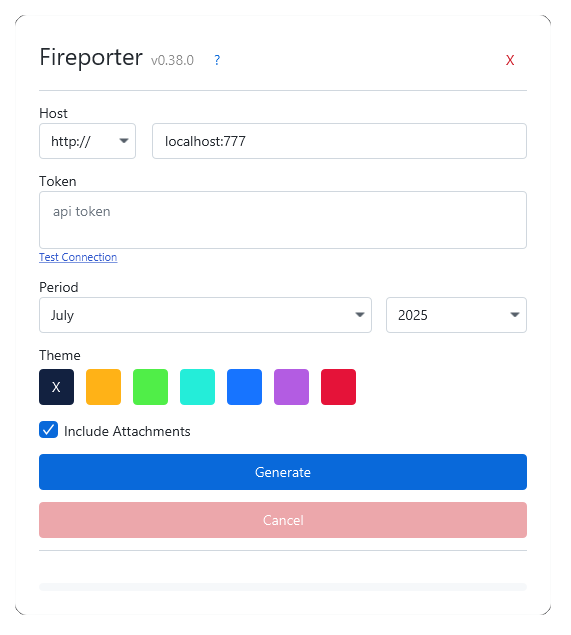

# Fireporter: Firefly III PDF Exporter

Fireporter is a third-party app for Firefly III, it uses Firefly's API to download your financial records and process it to a PDF file.

## 🚀 Installation

Download the latest Fireporter version here: [Fireporter Latest Version](https://github.com/vFadlan011/fireporter/releases/latest)

### MacOs x64 (Intel) (Build from Source)
Fireporter does not offer pre-built binaries for MacOS old architecture. You must build the application from the source code. [Guide on building Fireporter binaries](build.md)

## 📋 Requirements
- Firefly III version 6.x.x
- Personal Access Token (PAT)

## 🛠️ Usage

1. Enter the address to access your Firefly III installation.
2. Enter a Personal Access Token from your Firefly III account. You can create one on `Options -> Profile -> OAuth` page.
3. Choose the period you want to report.
4. Click `Generate` to create the PDF.

## ✅ TODO

- [ ] Add background color to table column header on transaction history
- [x] <s>Any-currency support (Major Update)</s>
- [x] <s>Toggle attachments</s>
- [x] <s>Add Logging</s>
- [x] <s>Build to executable for distribution</s>
- [x] <s>Github Action for building distributions</s>
- [x] New gradle task to rename installers and zipped images.

## ⚠️ Important Notes
- Currently, supports any currency but not multiple currencies. E.g. you can only have one currency in your Firefly III adminstration.
- Release are available for `Windows x64`, `Linux x64`, and `MacOS (Apple Silicon)`. But only Windows version that has been tested.
- Fireporter only reads data from Firefly III via API and formats it into a PDF.
- Tips: Store attachments as image instead of pdf for faster process. Fireporter will have to convert entire pages of PDF file to multiple image files before attaching it to generated report.

## 📄 Disclaimer
Fireporter is provided "as is", without warranty of any kind. The developer is not responsible for any loss, damage, or errors caused by use of this application. Use at your own risk.

## 📜 License
This project is licensed under the [GNU AGPL v3.0](LICENSE).

## 📌 Changelog
### 2.0.2 - 2025/08/24
- (BUG FIX) Fixed missing application icon on Linux
- (BUG FIX) Fixed incorrect application and installer name on Linux
- (BUG FIX) Fixed truncation of application name and version in the UI
- (BUG FIX) Fixed issue where inactive accounts were ignored instead of throwing `InactiveAccountException`
- (BUG FIX) Fixed incorrect initial balance calculation
- (BUG FIX) Fixed unresolved `decimalPlaces` when fetching currencies
- (REFACTOR) Added and implement `safeRequest` utility for centralized HTTP error handling (throws `ClientErrorException` on 4xx errors and `ServerErrorException` on 5xx errors).

### 2.0.1 - 2025/07/30
- Supports for any currency. (But not multi-currency)
- Change on transaction history table
- Add unit tests
- Bug fixes

### 1.0.3 - 2025/07/11
- New: Added a GitHub Action for building and releasing distributions.
- New: Implement up to service layers logging.
- New: Cache attachments after download until app closed.
- Changed: Switched the jdkDownload source to a custom JDK and JavaFX bundle.
- Changed: Jumped the major version to 1 to ensure compatibility with macOS.

### 0.39.0 - 2025/07/09
- Update java version 17 to java 21
- Update gradle version 8.2 to 8.10
- Change packaging plugin from org.beryx.jlink to com.dua3.gradle.runtime
- Write (working) packaging task for windows with `badass-runtime`
- Write untested packaging task for macos and linux